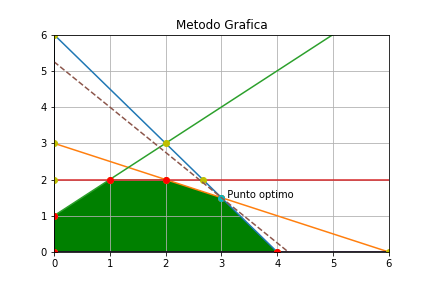

# Método-Grafico-P.L-python-
Calculo de puntos óptimos de un programa lineal con dos variables de decisión mediante el método gráfico en python

## Requisitos

El programa fue programado en Python 3.7.6 y usa las siguientes librerías

```xml
import math
import numpy as np
from matplotlib import pyplot as plt
```

## Funcionamiento
El programa calcula el punto optimo (máximo o minimo) de un programa lineal a través de los siguientes pasos:
 
* Calculo de intersecciones
* Calculo de puntos extremos
* Calculo de punto optimo (máximo o minimo)

Las funciones auxiliares para hacer los cálculos son:

* Escalar Grafica - Usa el valor máximo de las componentes se los puntos intersección para hacer un cuadrado con el tamaño de ese numero
* Metodo Grafico - función principal que implementa las demás funciones e imprime los plots para graficar las rectas de las restricciones, los puntos de intersección, los puntos extremos y el punto optimo

## Instrucciones
El programa recibe los datos en la forma canónica, como entrada un arreglo de nx2 formado por los coeficientes de las rectas que forman las restricciones, recibe el numero de restricciones del programa lineal, además recibe otro arreglo de mx1 con los coeficientes de recursos, también recibe los coeficientes de la función objetivo y se le debe de indicar si se desea maximizar o minimizar el programa lineal 
Ejemplo de datos de entrada al programa:
```xml
a=np.array([[6,4],[1,2],[-1,1],[0,1]])#2xn
c=np.array([24,6,1,2])#1xn
n=4;# numero de Restricciones
minimizar=False;#Si es minimo = true, si es maximo = false
z=[5,4]#Funcion Objetivo
```
De salida el programa nos dará un arreglo con las coordenadas del punto optimo, el valor de la función objetivo evaluada en el punto optimo y un archivo .png con la grafica del programa lineal, donde la región de soluciones factibles estará sombreada de verde, el punto optimo coloreado de azul, los puntos extremos de rojo y los puntos de las intersecciones de amarillo, además se dibujaran las rectas de las restricciones de diferentes colores y la función objetivo de color morado y punteada
Ejemplo de salida del programa
```xml
El punto optimo es: [3.0, 1.5]
El valor en el punto Optimo es: 21.0
```



Implementación de la función principal:
```xml
Punto_Optimo, Valor_Punto_Optimo = Metodo_Grafico(a, c, n, minimizar, z)
```
### Observaciones
* El programa no siempre rellena bien la región de soluciones factibles debido al orden en que se encuentran los puntos extremos
* Si no existe solución al programa lineal (ósea, no existe una región de soluciones factibles), el programa regresa False y 0
* Si la region de soluciones factibles, no esta encerrada por un polígono, esta no será sombreada, sin embargo, si se calculara el punto optimo de forma correcta

``` ## Pagina 
https://pi-q2.herokuapp.com/```
